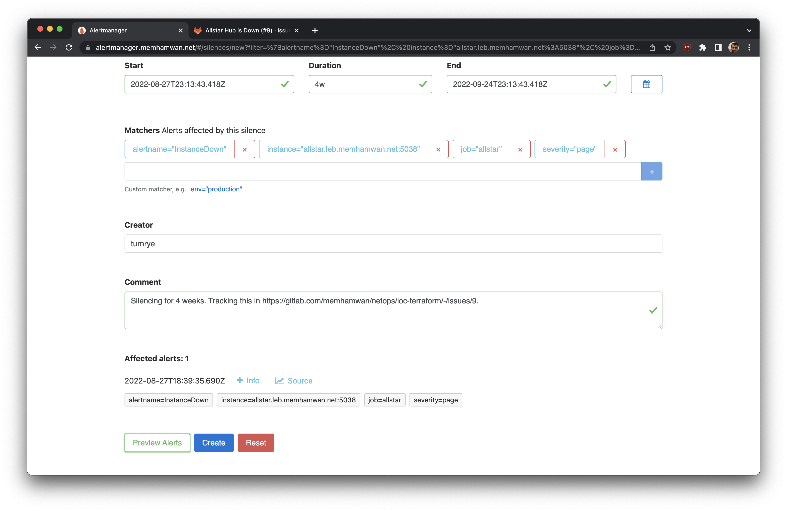

Sometimes, alerts need to be silenced. This may be because of planned maintenance, or maybe it's because of an outage that is being tracked in issues for follow-up. No matter what, silencing isn't a rare occurrence. This wiki page documents how to handle that process. Alert Manager is where alerts are deduplicated, grouped, and messaged. This is where any sort of silencing will take place. Note that the alert will continue to fire in upstream systems (i.e. [Prometheus](https://prometheus.memhamwan.net)), and this is expected. We want the downtime and alert condition to be tracked, just not to be messaged so as to avoid creating noise.

# Silencing Alerts

There are two steps to silencing the alert: identifying the pattern and writing the rest of the details. The steps are as follows:

## The easy way if its just one alert

1. Navigate to [alert manager](https://alertmanager.memhamwan.net/#/alerts)
2. Confirm that the alert you wish to silence is appearing on this page; if you're uncertain as to which alert relates to a specific message, click on the "+ Info" button to see that detail
3. Once you've found the alert that you wish to silence, click on the "Silence" button
4. Move on to "Writing the rest of the details" section below 

## The more powerful way for multiple alerts

1. Navigate to [alert manager](https://alertmanager.memhamwan.net/#/alerts)
2. Confirm that the alert you wish to silence is appearing on this page; if you're uncertain as to which alert relates to a specific message, click on the "+ Info" button to see that detail
3. Once you've found the alerts that you wish to silence, review the relevant labels displayed for it, as these values are how to will define a silencing rule; most of the time, you'll want to silence an alert for a given `instance` and `job`; for instance, you may want to silence all alerts matching `instance="allstar.leb.memhamwan.net:5038"` and `job="allstar"`
4. In the top section of the page under the "Filter" heading, add the matchers one at a time, and confirm that _just_ the item you wish to silence is being displayed; the right level of specificity must be given to avoid accidentally silencing future alerts too
5. Click on the "Silence" button in order to create the new silence pre-populated with your matchers
6. Move on to "Writing the rest of the details" section below

## Writing the rest of the details

1. Confirm that there is a GitLab issue logged that is describing what needs to be done for the silence to go away; add the "alertmanager silence" label to the issue
   
2. Consider how long the silence should be active; try to err on underestimating rather than overestimating the timeframe to avoid mistakenly leaving a silence running for too long; this value should be stated in terms of hours ("h"), days ("d"), or weeks ("w"); enter this value in the "duration" field
   
2. Under the "Creator" field, enter your GitLab username
3. Under the "Comment" field, write a brief explanation of why you are creating the silence; there should always be an accompanying GitLab Issue created, and be sure to link to it in your comment
   
4. Submit the silence
   
5. Copy and paste the URL to the silence into a comment on the GitLab issue so that it can be traced