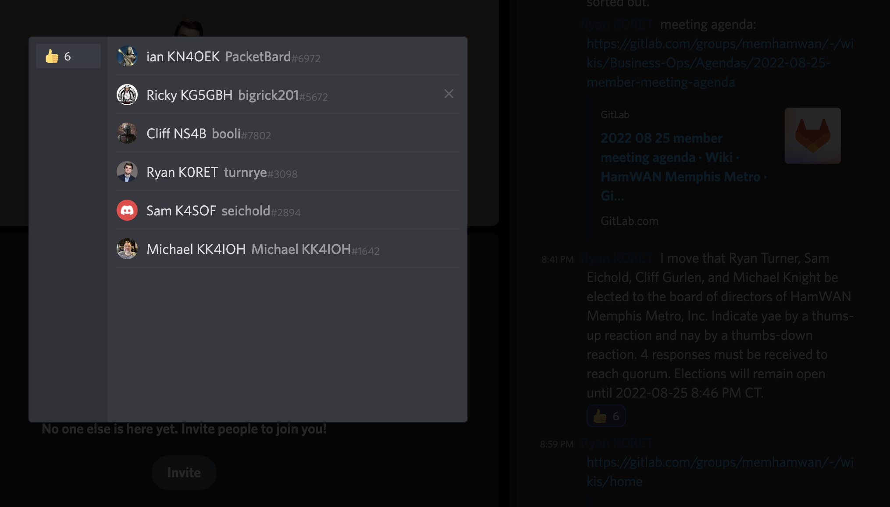

# HamWAN Memphis Metro 2022 Members Meeting

## Agenda

## Call to Order

- @turnrye: I call this meeting to order at 8:00 P.M. Central Time on August 25, 2022 taking place via Discord Voice Channel conference.

## Roll Call

- @seichold: According to article 13, section 5 of our bylaws, quorum for meetings of members is 50%. The member rolls for HamWAN Memphis Metro, Inc include the following persons; when your name is called, please indicate your attedance:
  * [x] Clifton Gurlen
  * [x] Ian Lucas
  * [ ] Luke Williams
  * [x] Michael Knight
  * [x] Richard Barnett
  * [x] Ryan Turner
  * [x] Samuel Eichold
- @seichold: A quorum of members has been met with only 1 member not attending.

## Reports

### President

- @rturner: a summary of achievements in 2021-2022; a thank-you to the current board; a reminder of what the current meeting's purpose is for electing the board and conducting any other business
  - New cloud connection to internet that has removed reliance on Ryan's personal infrastructure
  - Hosted services are being improved with scanners and other use cases picking up
  - Site maintenance is needed... All sites have open work items needed to bring them back up to full usage
  - Emergency services contacts need to be rebuilt. Desire to re-engage with NWS and Red Cross
  - Desire to drive software improvements inspired by Puget Sound Data Ring ("HamWAN")
  - Reminder that this meeting is an open business meeting and we at a minimum we need to elect a board. But, please bring any business items that are desired.

### Secretary Treasurer

- @seichold: presentation of the treasurer's report
- Note that we should make sure we redact individuals names and specific amounts given.

## Business

### Election of Board

- @seichold: I move that we open nominations for election of the 2022-2023 directors
  - Rick Barnett Seconded
- @rturner: election of the 2022-2023 board will take place via nominations from the floor. Pursuant with [Article 3 Section 1](../../../Bylaws#section-1-number) of our bylaws, tonight we will be electing four members of the board. At this time any member wishing to nominate a member to the board may raise their nomination by speaking that person's name.
- Ryan Turner
- Sam Eichold
- Cliff Gurlen
- Michael Knight
- @rturner: are there any further nominations?
- @rturner: Pursuant with [article 13 sections 7 and 8](../../../Bylaws#section-7-voting-rights) each member may vote on each motion, and election of directions shall take place via written ballot. For the sake of expediency, we will utilize threaded the chat in this Discord channel. Each motion will be sent as a message. Members may cast their ballots using "thumbs up" to indicate yae and a "thumbs down" to indicate a nay. Ballots will be open for 5 minutes. A sample ballot is as follows:

> I move that Ryan Turner, Sam Eichold, Cliff Gurlen, and Michael Knight be elected to the board of directors of HamWAN Memphis Metro, Inc. Indicate yae by a thums-up reaction and nay by a thumbs-down reaction. 4 responses must be received to reach quorum. Elections will remain open until 2022-08-25 8:46 PM CT.

- @rturner: I MOVE THAT we recess for 5 minutes in order to conduct our election by written ballot.
  - Cliff second

- @rturner: I call this meeting back to order at 8:44 PM CT. Congratulations to the new board of directors. Pursuant to [Article 3 Section 8](../../../Bylaws#section-8-regular-meetings) the first regular meeting of directors will take place on 2022-09-22 at 8 PM CT.
- @rturner: is there any other business?
- @seichold opened discussion on how to improve transparency of board activities and expectations of board members.
  - @turnrye proposes that we could have board interviews and publish those to our website. This could be used to promote Memhamwan and give insights into the organization.
  - @KK4IOH  brings up need to restart more formal outreach that has been less active (especially due to Covid). How can we get partners and others who help to 'sell' HamWAN.
  - General discussion that we should try to find new ways to get in front of people who are more likely to find value of working with
  - @PacketBard  agrees that we need to focus on how we make our work more accessible. Specifically an easy landing into the Wiki and other places for people to understand and engage.
  - @KK4IOH  brings up, how do we make it accessible for people who want to learn and understand.
  - @cliff.gurlen , Maybe its easier to make 'tech' people interested vs trying to make 'ham' people interested.
  - @turnrye , How can we choose technology that help engagement How we make it accessible.

## Adjournment

- @seichold: I MOVE THAT we adjourn the 2022 members meeting.
- Cliff seconded