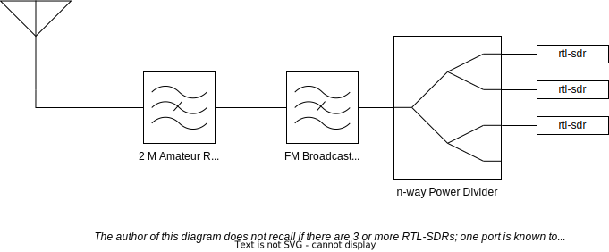

MemHamWAN hosts a LiveATC.net scanner appliance in midtown Memphis serving Memphis International and related nearby airspaces. This effort was deployed orginally in August and September 2022 with planning in https://gitlab.com/groups/memhamwan/-/epics/12.

## Accessing the Feed

### On-network access

While accessing HamWAN via part 97 connection, remember that use of encryption is not permitted. Direct refences to the audio feeds that do not require encryption are below:

- [KMEM Tower](http://d.liveatc.net/kmem2_twr)
- [Memphis Center RCO](http://d.liveatc.net/kmem2_zme)
- [Memphis Appproach](http://d.liveatc.net/kmem2_app)

### Off-network access

Access the feeds via [LiveATC.net's main page](https://www.liveatc.net/search/?icao=kmem).

## How it works

### Administration

This device is treated as a blackbox appliance on loan, meaning that we do not have to administrate it. Instead, LiveATC.net maintains the configuration remotely. However, we are responsible for a few things. Networking wise, the appliance expects to be served with DHCP, and it expects to not be directly internet facing. There are no specific ports that need to be forwarded.

### Physical Deployment

A folded dipole antenna is deployed on the tower, which is then connected to coax that runs into HamWAN's cabinet. There is a shelf in the cabinet where all of the filters, receivers, and computers are located.



### Network Configuration

The appliance is connected directly to `r1.sco` on port `ether15`. The relevant configurations at the time of this writing are:

```
/interface bridge
add name=nat
/interface bridge port
add bridge=nat interface=ether15
/ip address
add address=192.168.7.1/24 interface=nat network=192.168.7.0
/ip pool
add name=dhcp_pool1 ranges=192.168.7.2-192.168.7.254
/ip dhcp-server network
add address=192.168.7.0/24 dns-server=44.34.132.1 gateway=192.168.7.1
/ip dhcp-server
add address-pool=dhcp_pool1 disabled=no interface=nat name=dhcp1
/ip firewall nat
add action=masquerade chain=srcnat out-interface=bridge src-address=192.168.7.0/24
```

Note that this snippet is not maintained, but it is a good reference for how the device is setup.