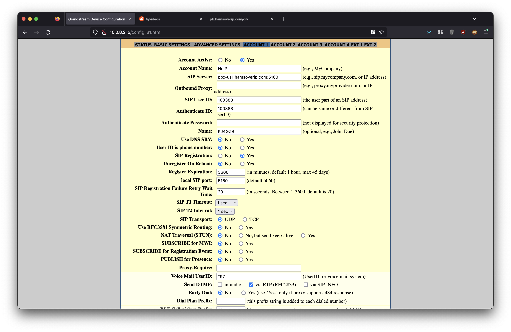
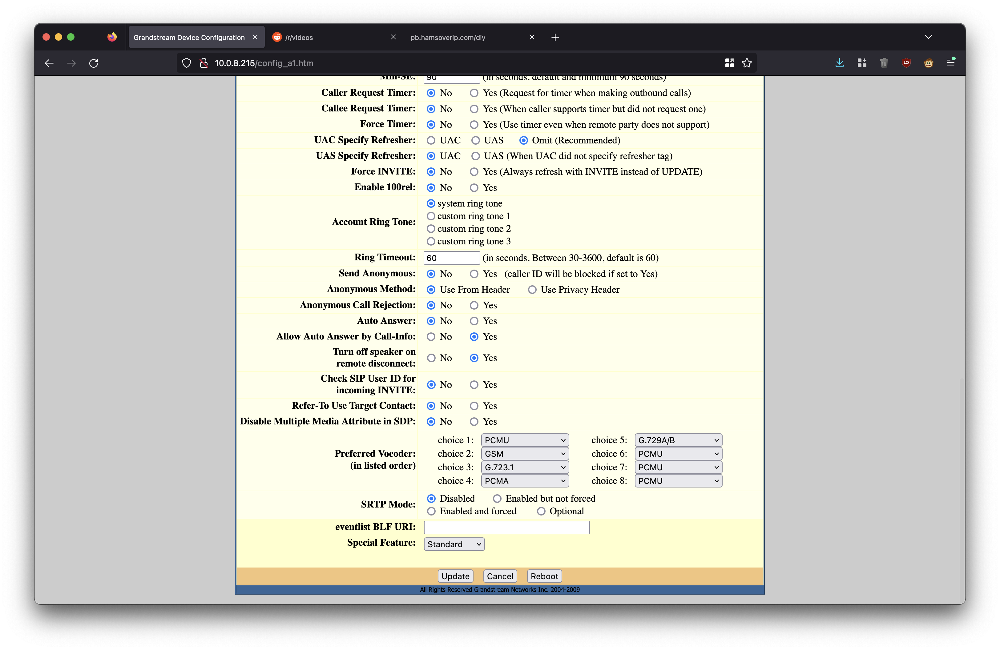
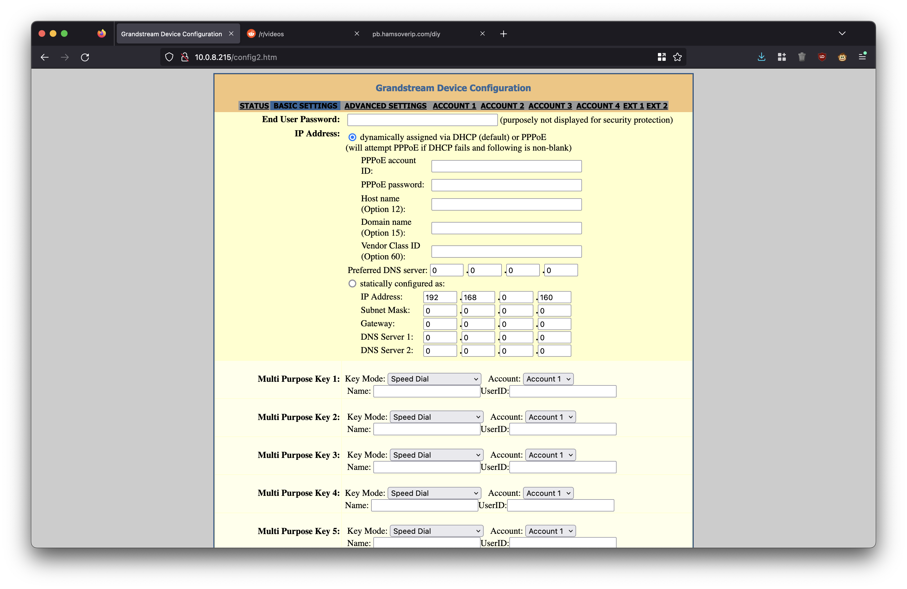
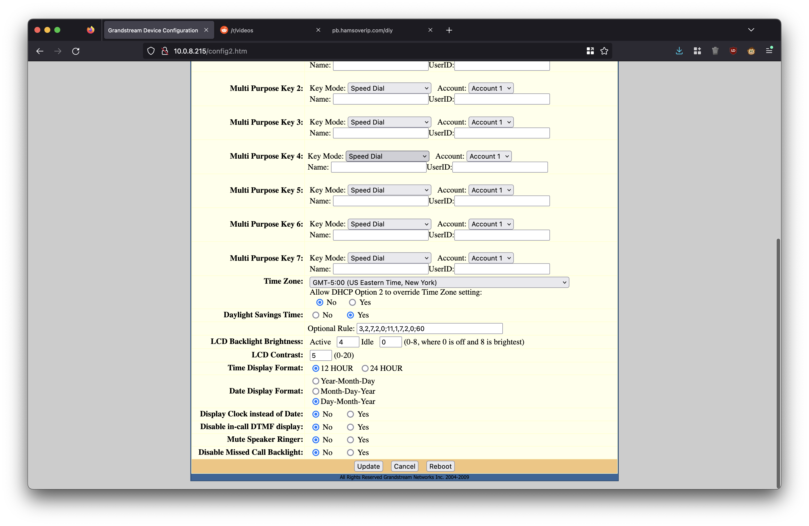
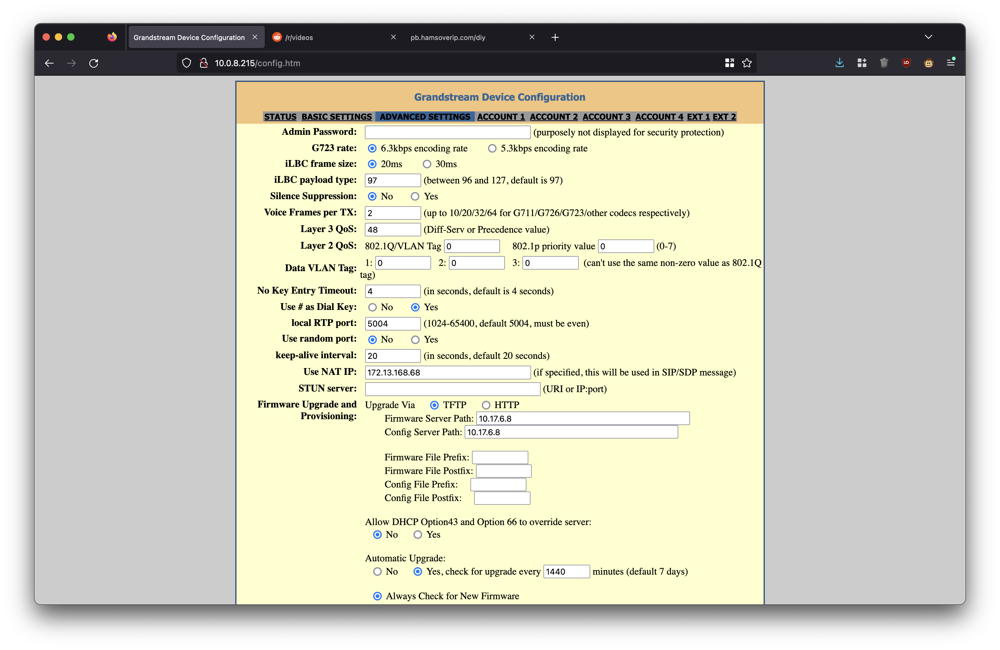
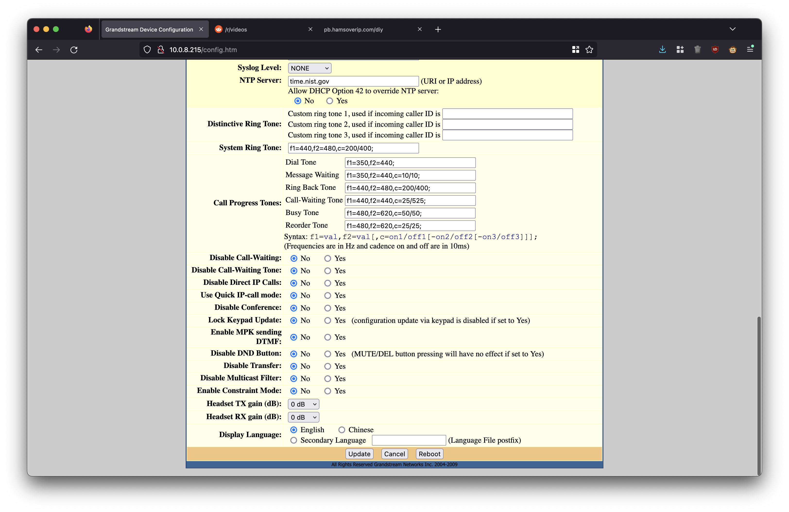

Grandstream GXP2000s can be found on eBay both new and used for very low prices, and it's for good reason: these phones are _old_. There are a number of good resources for VoIP folks to configure these devices, [especially detailed tutorials like this on asteriskguru.com](https://www.asteriskguru.com/tutorials/gxp2000_grandstream_hardphone.html).

For simple use though, sometimes these tutorials can be too long and confusing. Especially if you're unfamiliar with the underlying concepts and just trying to configure the device as an endpoint on a hosted exchange like Hams Over IP or Hamshack Hotline. This rough set of instructions helps guide you through one of these bare bones configurations.

# Prerequisites

## Local device powered on and accessed via web interface

The Grandstream GXP2000 should be turned on and on a local network. While powered on, the screen should display what the IP address is for the interface. This is how you will access the control interface.

This device's default admin password is "admin", so login with that.

## Endpoint configuration

Exchanges like Hams Over IP and Hamshack Hotline will provision a new "endpoint" (that's fancy speak for phone) for you to connect with. They will give instructions on what the server is, what your username is, and what your password is. These things are unique to you, and you'll need to provide them.

# Configuring 
## Your network

Make sure that you have a working internet connection. This assumes you're using IPv4, that you have NAT setup, and that you're running a DHCP server locally. If you have normal home internet, it's fair to assume that you have all of these things already. You may also need _outbound_ firewall rules updated depending on how complicated your setup is, but this is out-of-scope of this guide.

## Your device

In this example, we're configuring 100383 on Hams Over IP for KJ4GZB. His password is entered in the "Authenticate Password" field. Be sure to put your correct server, user id, and password in. 

Given the information from your exchange, modify the values on the "Account 1" page to look like this:




Then, modify the values on the "Basic" page to look like this:




Use [this page](https://pb.hamsoverip.com/diy/) to find what your public IP address is, and be sure to put this in the "Use NAT IP" field. Note that if your public IP changes, you'll need to come and change this value. Finally, modify the valeus on the "Advanced" page to look like this:




Once this is done, reboot your phone (unplug and replug is fine) and then wait for it to register. This may take about 2-3 minutes. The phone's LCD screen should indicate the status of registration. Once it's done, go ahead and try a few test calls! Refer to the lsit below for two example extensions:

```
3192 	Talking Clock 	This will give you the date and time of the system
3194 	Echo Test 	This will allow you test your latency between you and the server. In this mode, the system will echo back to you whatever you say as soon as you say it.
```

## Troubleshooting

[Refer to their FAQs](https://hamsoverip.github.io/wiki/General/user_guides/faq/) as a good starting point.

When testing these devices, I found that Hams Over IP admins needed to make a change from their side for this to work. If you follow the steps above and registration fails, or audio doesnt work, or inbound calling doesn't work, open a support ticket with your exchange and have them help you troubleshooting. This is not a consequence of the phone's configuration but instead of your network and the exchange -- this is something that only they can help with.
